# 🥞 Stax

**Stax** is a lightweight library that leverages Auto Layout, UIStackViews and UIScrollViews to build out your UI programmatically with just a few lines of code.

## 💻 Installation
### 📦 Swift Package Manager
Using <a href="https://swift.org/package-manager/" rel="nofollow">Swift Package Manager</a>, add it as a Swift Package in Xcode 11.0 or later, `select File > Swift Packages > Add Package Dependency...` and add the repository URL:
```
https://github.com/rebeloper/Stax.git
```
### ✊ Manual Installation
Download and include the `Stax` folder and files in your codebase.

### 📲 Requirements
- iOS 11 (some optional features iOS13+)
- Swift 5

## 👑 Concept
`Stax` uses the idea of laying out your views entirely with **Stacks**. Under the hood it uses `UIStackView`s to create horizontal or vertical stacks. You may set any of these **Stacks** to be scrollable. **Stacks** are nestable and follow a declarative writing style. As a bonus you may also center a view inside another one.

## 🧳 Features
- [X] Pure Swift 5 sweetness.
- [X] Everything you can do with Auto Layout, but shorter.
- [X] Constraints are active by default.
- [X] 100% compatible with other Auto Layout code.
- [X] No need to set `translatesAutoresizingMaskIntoConstraints` because `Stax` does it for you.
- [X] Leverages the power of `UIScrollView` and `UIStackView`: stack views, scroll views.
- [X] Scroll programmatically to top / bottom / left / right.
- [X] Lay out views with Stacks **only**.
- [X] Show / hide views on the fly.
- [X] Write UI code in a declarative way (much like in `SwiftUI`).
- [X] Easy-to-understand usage.
- [X] No external dependencies.
- [X] 100% Documented.

## 🛠 Before we begin

This UIViewController structure is assumed in the following examples

```
import UIKit
import Stax

class ExampleViewController: UIViewController {
    
    // MARK: - Views
    
    // MARK: - Layout views
    
    fileprivate func layoutViews() {
        
    }
    
    // MARK: - Lifecycle
    
    override func viewDidLoad() {
        super.viewDidLoad()
        view.backgroundColor = .systemBackground
        title = "Stax"
        layoutViews()
    }
}
```

In the examples below we will cover the code that is marked as **Views** and **Layout views**

## 👉 Import

Import `Stax` into your `ViewController`

```
import Stax
```

## 📚 A word about how `UIStackViews` work and `size` setting with `Stax`

`UIStackViews` are pull-in views: they take up the least amount of space from their parent view filling themselves with the least amount of space that their arranged subviews need. Thus it's crucial that all views added to the **Stack** have their own size. Some views do have an intrisic size (a size set automatically upon initialization): `UIButton`, `UILabel`. But not all views have an intrinsic size: `UIView`, `UIImageView`. So here are the ways we can set size in `Stax`

## 📏 Size

```
let view0 = UIView(width: 100)
let view1 = UIView(height: 100)
let view2 = UIView(width: 100, height: 200)
let view3 = UIView(square: 100)
lazy var view4 = UIView(width: self.view.frame.size.width)
```

Note: if we want to get acces to `self` when we create these views they must be `lazy var`.

## 🎨 Background color

We may also add background color within the initialization of any `UIView`. Helpful when laying out views quickly. This way we see the frame of the views in an easy tweak. All types of previously listed initializations have this optional property. Default value is `.clear`.

```
let view0 = UIView(width: 100, backgroundColor: .systemBlue)
```

Adding a background color to or view to debug our layout is common practice, but `Stax` has something more powerfull: `StaxDebugOptions`. When added as a property to a `UIView` you will see a debug layer on top of your view. Default value is `nil` which will not add any debug layer. `StaxDebugOptions` is available on iOS13+.

```
let view0 = UIView(width: 100, staxDebugOptions: StaxDebugOptions())
```

We will talk more in detail about `StaxDebugOptions` below when we will show them inside a stack.

## 👈.....👉 Spacer

Since `UIStackView` is a pull-in view we will need a push-out view in order to use them more efficiently. This is where `Spacer` comes in. It is an empty `UIView` that can push views. Here's an example of a `Spacer` pushing `view2` to the top in this `VStack` layed out in the view controller's `view`. (Don't worry about understanding the stack or the layout. We'll talk about them soon enough.)

```
// MARK: - Views

let view0 = UIView(height: 100, backgroundColor: .systemBlue, staxDebugOptions: StaxDebugOptions())

// MARK: - Layout views

fileprivate func layoutViews() {
    VStack(
        view0,
        Spacer()
    ).layout(in: view, withSafeArea: true)
}
```

<details>
    
</details>

## 👈.👉 Divider

Dividers are much like `Spacer`s but they have a fixed `width` / `height`. By default this value is `16`. Dividers have two axis: `.vertical`, `.horizontal`. Default axis is `.vertical`. You may also want to use `VDivider` and `HDivider`. 
Note: `Divider`s ususally do not have a background color. I'm just using `.systemOrange` here so we may see it on screen.

```
// MARK: - Views

// MARK: - Layout views

fileprivate func layoutViews() {
    VStack(
        Divider().background(color: .systemOrange),
        Spacer()
    ).layout(in: view, withSafeArea: true)
}
```

<details>
    <summary>Screenshot</summary>
    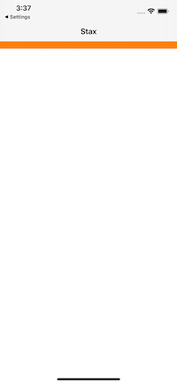
</details>

```
// MARK: - Views

// MARK: - Layout views

fileprivate func layoutViews() {
    VStack(
        Divider(.vertical, 400).background(color: .systemOrange),
        Spacer()
    ).layout(in: view, withSafeArea: true)
}
```

<details>
    <summary>Screenshot</summary>
    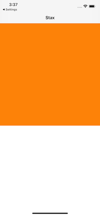
</details>

```
// MARK: - Views

// MARK: - Layout views

fileprivate func layoutViews() {
    VStack(
        VDivider().background(color: .systemOrange),
        Spacer()
    ).layout(in: view, withSafeArea: true)
}
```

<details>
    <summary>Screenshot</summary>
    
</details>

```
// MARK: - Views

// MARK: - Layout views

fileprivate func layoutViews() {
    VStack(
        VDivider(400).background(color: .systemOrange),
        Spacer()
    ).layout(in: view, withSafeArea: true)
}
```

<details>
    <summary>Screenshot</summary>
    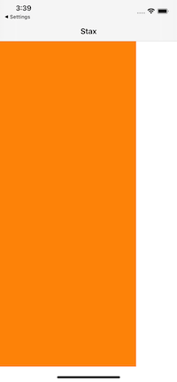
</details>

```
// MARK: - Views

// MARK: - Layout views

fileprivate func layoutViews() {
    HStack(
        Divider(.horizontal).background(color: .systemOrange),
        Spacer()
    ).layout(in: view, withSafeArea: true)
}
```

<details>
    <summary>Screenshot</summary>
    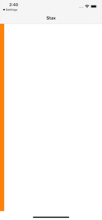
</details>

```
// MARK: - Views

// MARK: - Layout views

fileprivate func layoutViews() {
    HStack(
        Divider(.horizontal, 300).background(color: .systemOrange),
        Spacer()
    ).layout(in: view, withSafeArea: true)
}
```

<details>
    <summary>Screenshot</summary>
    
</details>

```
// MARK: - Views

// MARK: - Layout views

fileprivate func layoutViews() {
    HStack(
        HDivider().background(color: .systemOrange),
        Spacer()
    ).layout(in: view, withSafeArea: true)
}
```

<details>
    <summary>Screenshot</summary>
    
</details>

```
// MARK: - Views

// MARK: - Layout views

fileprivate func layoutViews() {
    HStack(
        HDivider(300).background(color: .systemOrange),
        Spacer()
    ).layout(in: view, withSafeArea: true)
}
```

<details>
    <summary>Screenshot</summary>
    
</details>

## 👇___ Line ( available iOS 13.0+ )

Adding a line in your UI is common. You may add a `Line` with a lot of properties, `VLine` for a vertical line, `HLine` for a horizontal line.

```
// MARK: - Views

// MARK: - Layout views

fileprivate func layoutViews() {
    VStack(
        VDivider(400).background(color: .systemOrange),
        HLine(),
        VDivider().background(color: .systemOrange),
        Spacer()
    ).layout(in: view, withSafeArea: true)
}
```

<details>
    <summary>Screenshot</summary>
    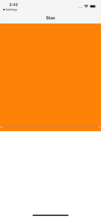
</details>

```
// MARK: - Views

// MARK: - Layout views

fileprivate func layoutViews() {
    HStack(
        HDivider(300).background(color: .systemOrange),
        VLine(),
        HDivider().background(color: .systemOrange),
        Spacer()
    ).layout(in: view, withSafeArea: true)
}
```

<details>
    <summary>Screenshot</summary>
    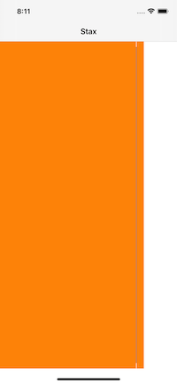
</details>

```
// MARK: - Views

// MARK: - Layout views

fileprivate func layoutViews() {
    VStack(
        VDivider(400).background(color: .systemOrange),
        Line(.horizontal, 6, UIColor.black.withAlphaComponent(0.5), insets: UIEdgeInsets(top: 0, left: 48, bottom: 0, right: 48)),
        VDivider().background(color: .systemOrange),
        Spacer()
    ).layout(in: view, withSafeArea: true)
}
```

<details>
    <summary>Screenshot</summary>
    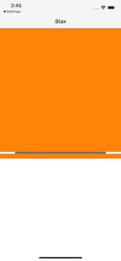
</details>

```
// MARK: - Views

// MARK: - Layout views

fileprivate func layoutViews() {
    HStack(
        HDivider(300).background(color: .systemOrange),
        VLine(30, .black, insets: UIEdgeInsets(top: 10, left: 0, bottom: 50, right: 0), withRoundedCorners: false),
        HDivider().background(color: .systemOrange),
        Spacer()
    ).layout(in: view, withSafeArea: true)
}
```

<details>
    <summary>Screenshot</summary>
    
</details>

## 🐞 Debuging

We may put a debug view on any of our views. You may initialize any `UIView` with the `staxDebugOptions` property.

```
// MARK: - Views

let view0 = UIView(height: 100, backgroundColor: .systemBlue, staxDebugOptions: StaxDebugOptions())

// MARK: - Layout views

fileprivate func layoutViews() {
    VStack(
        view0,
        Spacer()
    ).layout(in: view, withSafeArea: true)
}
```

<details>
    <summary>Screenshot</summary>
    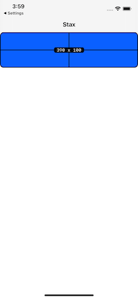
</details>

When you do not want to initialize with `staxDebugOptions` you may debug the view inside the stack.

```
// MARK: - Views

let view0 = UIView(height: 100, backgroundColor: .systemBlue)

// MARK: - Layout views

fileprivate func layoutViews() {
    VStack(
        view0.debug(),
        Spacer()
    ).layout(in: view, withSafeArea: true)
}
```

<details>
    <summary>Screenshot</summary>
    
</details>

You may create your own custom debug options.

```
// MARK: - Custom Debug Options
let customStaxDebugOptions = StaxDebugOptions(borderWidth: 5, cornerRadius: 0, color: .systemRed, lineWidth: 10, font: .italicSystemFont(ofSize: 30), textColor: .darkGray, textCornerRadius: 15)

// MARK: - Views

lazy var view0 = UIView(height: 300, backgroundColor: .systemBlue, staxDebugOptions: customStaxDebugOptions)

// MARK: - Layout views

fileprivate func layoutViews() {
    VStack(
        view0,
        Spacer()
    ).layout(in: view, withSafeArea: true)
}
```

<details>
    <summary>Screenshot</summary>
    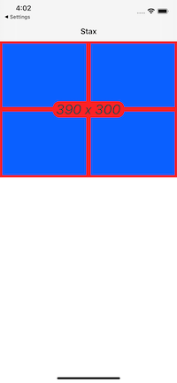
</details>

Or use one of the preset ones. Default is `adaptive`. See the diferent `type`s ont both light and dark appearance below.

```
// MARK: - Views

lazy var view0 = UIView(height: 200, backgroundColor: .systemBlue, staxDebugOptions: StaxDebugOptionsType.dark)
lazy var view1 = UIView(height: 200, backgroundColor: .systemOrange, staxDebugOptions: StaxDebugOptionsType.light)
lazy var view2 = UIView(height: 200, backgroundColor: .systemRed, staxDebugOptions: StaxDebugOptionsType.adaptive)

// MARK: - Layout views

fileprivate func layoutViews() {
    VStack(
        view0,
        view1,
        view2,
        Spacer()
    ).layout(in: view, withSafeArea: true)
}
```
<details>
    <summary>Screenshot Light</summary>
    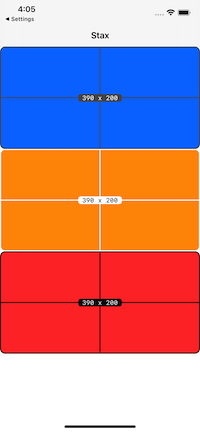
</details>

<details>
    <summary>Screenshot Dark</summary>
    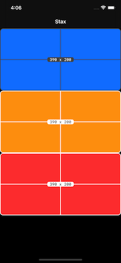
</details>

## 🎨 Background color on views inside stacks, on stacks and on scroll views

When you build out views with `Stax` you may not properly evaluate where the stack's views are layed out exactly. To make our lives easier we can just simply add background colors. We can add a background color to: `UIView`, `UIStackView` and `UIScrollView`.

```
// MARK: - Views

let view0 = UIView(height: 100, staxDebugOptions: StaxDebugOptions())

// MARK: - Layout views

fileprivate func layoutViews() {
    VStack(
        view0.background(color: .systemOrange),
        Spacer()
    ).layout(in: view, withSafeArea: true)
}
```

<details>
    <summary>Screenshot</summary>
    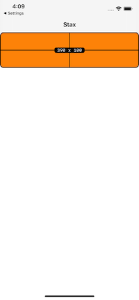
</details>

```
// MARK: - Views

let view0 = UIView(height: 100, staxDebugOptions: StaxDebugOptions())

// MARK: - Layout views

fileprivate func layoutViews() {
    VStack(
        view0.background(color: .systemOrange),
        Spacer()
    ).background(.systemBlue).layout(in: view, withSafeArea: true)
}
```

<details>
    <summary>Screenshot</summary>
    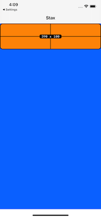
</details>

```
// MARK: - Views

let view0 = UIView(height: 100, staxDebugOptions: StaxDebugOptions())

// MARK: - Layout views

fileprivate func layoutViews() {
    VStack(
        view0.background(color: .systemOrange),
        Spacer()
    ).scrolls().background(.systemGreen).layout(in: view, withSafeArea: true)
}
```

<details>
    <summary>Screenshot</summary>
    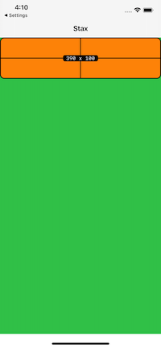
</details>

## 🍩 Centering 

The second most important part in laying out UI in `Stax` besides stacking is **centering** a view inside a parent view. Centering has to be done outside of the main stack. See the example view controller below.

```
// MARK: - Views

let view0 = UIView(height: 400, backgroundColor: .systemOrange, staxDebugOptions: StaxDebugOptions())
let view1 = UIView(backgroundColor: .systemBlue, staxDebugOptions: StaxDebugOptions())

// MARK: - Layout views

fileprivate func layoutViews() {
    
    view1.center(in: view0, size: .square(100), offset: CGPoint(x: 70, y: 80))
    
    VStack(
        view0,
        Spacer()
    ).layout(in: view, withSafeArea: true)
}
```

<details>
    <summary>Screenshot</summary>
    
</details>

```
// MARK: - Views

let view0 = UIView(height: 400, backgroundColor: .systemOrange, staxDebugOptions: StaxDebugOptions())
let view1 = UIView(width: 100, backgroundColor: .systemBlue, staxDebugOptions: StaxDebugOptions())
let view2 = UIView(width: 100, backgroundColor: .systemGreen, staxDebugOptions: StaxDebugOptions())

// MARK: - Layout views

fileprivate func layoutViews() {
    
    HStack(view1, view2).center(in: view0, size: CGSize(width: 200, height: 100), offset: CGPoint(x: 70, y: 80))
    
    VStack(
        view0,
        Spacer()
    ).layout(in: view, withSafeArea: true)
}
```

<details>
    <summary>Screenshot</summary>
    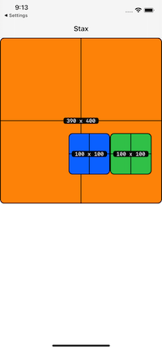
</details>

```
// MARK: - Views

let view0 = UIView(height: 400, backgroundColor: .systemOrange, staxDebugOptions: StaxDebugOptions())
let view1 = UIView(width: 100, backgroundColor: .systemBlue, staxDebugOptions: StaxDebugOptions())
let view2 = UIView(width: 100, backgroundColor: .systemGreen, staxDebugOptions: StaxDebugOptions())

// MARK: - Layout views

fileprivate func layoutViews() {
    
    HStack(view1, view2).scrolls(.horizontal).center(in: view0, size: .square(100), offset: CGPoint(x: 70, y: 80))
    
    VStack(
        view0,
        Spacer()
    ).layout(in: view, withSafeArea: true)
}
```

<details>
    <summary>Screenshot</summary>
    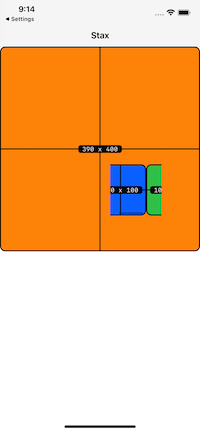
</details>

## 🍔 Stacks

There are two types of Stacks in `Stax`: `VStack` and `HStack` (Vertical Stack and Horizontal Stack).
The way we add a stack onto any view is laying it with `layout(in:)`. Usually this is done only once with the main Stack layed out in the view controller's view. You may also lay out with taking the safe area into acount.

```
// MARK: - Views

let view0 = UIView(height: 200, backgroundColor: .systemOrange, staxDebugOptions: StaxDebugOptions())
let view1 = UIView(height: 200, backgroundColor: .systemBlue, staxDebugOptions: StaxDebugOptions())

// MARK: - Layout views

fileprivate func layoutViews() {
    
    VStack(
        Spacer(),
        view0,
        view1
    ).layout(in: view)
}
```

<details>
    <summary>Screenshot</summary>
    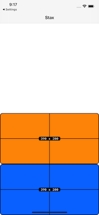
</details>

```
// MARK: - Views

let view0 = UIView(height: 200, backgroundColor: .systemOrange, staxDebugOptions: StaxDebugOptions())
let view1 = UIView(height: 200, backgroundColor: .systemBlue, staxDebugOptions: StaxDebugOptions())

// MARK: - Layout views

fileprivate func layoutViews() {
    
    VStack(
        Spacer(),
        view0,
        view1
    ).layout(in: view, withSafeArea: true)
}
```

<details>
    <summary>Screenshot</summary>
    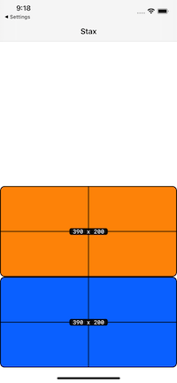
</details>

```
// MARK: - Views

let view0 = UIView(width: 200, backgroundColor: .systemOrange, staxDebugOptions: StaxDebugOptions())
let view1 = UIView(width: 200, backgroundColor: .systemBlue, staxDebugOptions: StaxDebugOptions())

// MARK: - Layout views

fileprivate func layoutViews() {
    
    HStack(
        Spacer(),
        view0,
        view1
    ).layout(in: view)
}
```

<details>
    <summary>Screenshot</summary>
    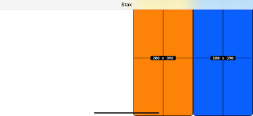
</details>

```
// MARK: - Views

let view0 = UIView(width: 200, backgroundColor: .systemOrange, staxDebugOptions: StaxDebugOptions())
let view1 = UIView(width: 200, backgroundColor: .systemBlue, staxDebugOptions: StaxDebugOptions())

// MARK: - Layout views

fileprivate func layoutViews() {
    
    HStack(
        Spacer(),
        view0,
        view1
    ).layout(in: view, withSafeArea: true)
}
```

<details>
    <summary>Screenshot</summary>
    
</details>

Note: The `Spacer` is pushing the two views out to the sides of the container view.

You can have stacks within stacks.

```
// MARK: - Views

let view0 = UIView(square: 150, backgroundColor: .systemOrange, staxDebugOptions: StaxDebugOptions())
let view1 = UIView(width: 100, backgroundColor: .systemBlue, staxDebugOptions: StaxDebugOptions())
let view2 = UIView(height: 200, backgroundColor: .systemGreen, staxDebugOptions: StaxDebugOptions())
let view3 = UIView(height: 170, backgroundColor: .systemYellow, staxDebugOptions: StaxDebugOptions())

// MARK: - Layout views

fileprivate func layoutViews() {
    
    VStack(
        HStack(view0,
               view1,
               Spacer()),
        VStack(view2,
               view3),
        Spacer()
    ).layout(in: view, withSafeArea: true)
}
```

<details>
    <summary>Screenshot</summary>
    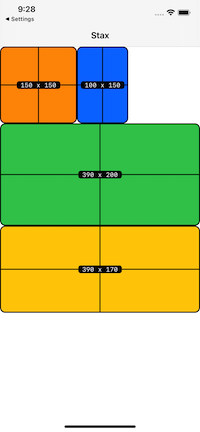
</details>

## 📜 Scrolling

You can enable scrolling with one line.

```
// MARK: - Views

let view0 = UIView(square: 150, backgroundColor: .systemOrange, staxDebugOptions: StaxDebugOptions())
let view1 = UIView(width: 500, backgroundColor: .systemBlue, staxDebugOptions: StaxDebugOptions())
let view2 = UIView(height: 200, backgroundColor: .systemGreen, staxDebugOptions: StaxDebugOptions())
let view3 = UIView(height: 500, backgroundColor: .systemYellow, staxDebugOptions: StaxDebugOptions())

// MARK: - Layout views

fileprivate func layoutViews() {
    
    VStack(
        HStack(view0,
               view1,
               Spacer()).scrolls(.horizontal),
        VStack(view2,
               view3),
        Spacer()
    ).scrolls().layout(in: view)
}
```

<details>
    <summary>Screenshot</summary>
    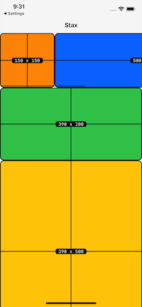
</details>

Notes: 
- The defalyt value is `.vertical`. 
- We can remove the safe area property from `layout(in:)` because the navigation bar will push the main stack to the tab bar's bottom. When a Tab bar is also added it will also behave as the navigation bar pushin gthe stack to the top of the tab bar. Of course, you may leave the safe area property if that is needed for your specific layout. 
- Notice the `Spacer()`s. This is left here because your layput may be viewed on displays with a `width`/`height` larger than the Stacks' `width`/`height`. In this case the `ScrollView` will act as a `StackView`.

## 👉👈 Spacing

Spacing between the stack elements is also simple. Default value is `8`.

```
// MARK: - Views

let view0 = UIView(height: 150, backgroundColor: .systemOrange, staxDebugOptions: StaxDebugOptions())
let view1 = UIView(height: 50, backgroundColor: .systemBlue, staxDebugOptions: StaxDebugOptions())
let view2 = UIView(height: 100, backgroundColor: .systemGreen, staxDebugOptions: StaxDebugOptions())
let view3 = UIView(height: 150, backgroundColor: .systemYellow, staxDebugOptions: StaxDebugOptions())

// MARK: - Layout views

fileprivate func layoutViews() {
    
    VStack(
        view0,
        view1,
        view2,
        view3,
        Spacer()
    ).spacing().scrolls().layout(in: view)
}
```

<details>
    <summary>Screenshot</summary>
    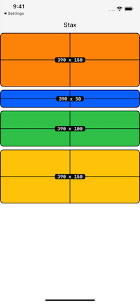
</details>

```
// MARK: - Views

let view0 = UIView(height: 150, backgroundColor: .systemOrange, staxDebugOptions: StaxDebugOptions())
let view1 = UIView(height: 50, backgroundColor: .systemBlue, staxDebugOptions: StaxDebugOptions())
let view2 = UIView(height: 100, backgroundColor: .systemGreen, staxDebugOptions: StaxDebugOptions())
let view3 = UIView(height: 150, backgroundColor: .systemYellow, staxDebugOptions: StaxDebugOptions())

// MARK: - Layout views

fileprivate func layoutViews() {
    
    VStack(
        view0,
        view1,
        view2,
        view3,
        Spacer()
    ).spacing(36).scrolls().layout(in: view)
}
```

<details>
    <summary>Screenshot</summary>
    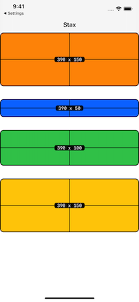
</details>

## 🌅 Padding

Padding can be added to both `Stack` and `ScrollView`. Default value is `8`.

```
// MARK: - Views

let view0 = UIView(height: 150, backgroundColor: .systemOrange, staxDebugOptions: StaxDebugOptions())

// MARK: - Layout views

fileprivate func layoutViews() {
    
    VStack(
        view0,
        Spacer()
    )/*.scrolls()*/.padding().layout(in: view)
}
```

<details>
    <summary>Screenshot</summary>
    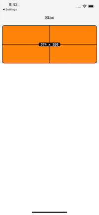
</details>

```
// MARK: - Views

let view0 = UIView(height: 150, backgroundColor: .systemOrange, staxDebugOptions: StaxDebugOptions())

// MARK: - Layout views

fileprivate func layoutViews() {
    
    VStack(
        view0,
        Spacer()
    )/*.scrolls()*/.padding(by: 36).layout(in: view)
}
```

<details>
    <summary>Screenshot</summary>
    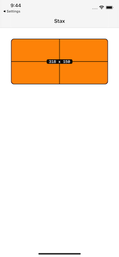
</details>

```
// MARK: - Views

let view0 = UIView(height: 150, backgroundColor: .systemOrange, staxDebugOptions: StaxDebugOptions())

// MARK: - Layout views

fileprivate func layoutViews() {
    
    VStack(
        view0,
        Spacer()
    )/*.scrolls()*/.padding(UIEdgeInsets(top: 36, left: 24, bottom: 0, right: 12)).layout(in: view)
}
```

<details>
    <summary>Screenshot</summary>
    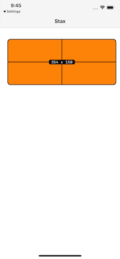
</details>

```
// MARK: - Views

let view0 = UIView(height: 150, backgroundColor: .systemOrange, staxDebugOptions: StaxDebugOptions())

// MARK: - Layout views

fileprivate func layoutViews() {
    
    VStack(
        view0,
        Spacer()
    )/*.scrolls()*/.padding(.top).layout(in: view)
}
```

<details>
    <summary>Screenshot</summary>
    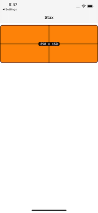
</details>

```
// MARK: - Views

let view0 = UIView(height: 150, backgroundColor: .systemOrange, staxDebugOptions: StaxDebugOptions())

// MARK: - Layout views

fileprivate func layoutViews() {
    
    VStack(
        view0,
        Spacer()
    )/*.scrolls()*/.padding(.top, 36).layout(in: view)
}
```

<details>
    <summary>Screenshot</summary>
    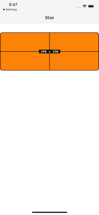
</details>

## ⚙️ Scrolling Options

We can set basic options on the `ScrollView`:

```
// MARK: - Views

lazy var view0 = UIView(square: self.view.frame.width, backgroundColor: .systemOrange, staxDebugOptions: StaxDebugOptions())
lazy var view1 = UIView(width: self.view.frame.width, backgroundColor: .systemBlue, staxDebugOptions: StaxDebugOptions())
lazy var view2 = UIView(width: self.view.frame.width, backgroundColor: .systemRed, staxDebugOptions: StaxDebugOptions())

// MARK: - Layout views

fileprivate func layoutViews() {
    VStack(
        HStack(
            view0,
            view1,
            view2,
            Spacer()
        ).scrolls(.horizontal)
        .pages()
        .hidesScrollIndicator()
//            .showsScrollIndicator()
        .bounces(false)
        .height(self.view.frame.width),
        Spacer()
    ).scrolls().layout(in: view)
}
```

<details>
    <summary>Screenshot</summary>
    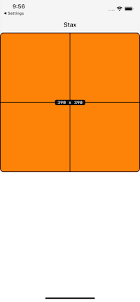
</details>

## 🦾 Auto-scrolling

We can also automatically scroll to a specific view. You might want to delay the scroll by `0.05` when you are scrolling upon initializing the view controller. Default `delay` is `0`. Default `animated` is `true`. You must specifiy the `axis` of the scroll. You may also set an optional offset too.

```
// MARK: - Views

lazy var view0 = UIView(square: self.view.frame.width, backgroundColor: .systemOrange, staxDebugOptions: StaxDebugOptions())
lazy var view1 = UIView(width: self.view.frame.width, backgroundColor: .systemBlue, staxDebugOptions: StaxDebugOptions())
lazy var view2 = UIView(width: self.view.frame.width, backgroundColor: .systemRed, staxDebugOptions: StaxDebugOptions())

// MARK: - Layout views

fileprivate func layoutViews() {
    VStack(
        HStack(
            view0,
            view1,
            view2,
            Spacer()
        ).scrolls(.horizontal)
        .scroll(to: view1, axis: .horizontal, delay: 2)
        .height(self.view.frame.width),
        Spacer()
    ).scrolls().layout(in: view)
}
```

<details>
    <summary>Screenshot</summary>
    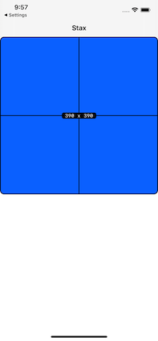
</details>

We can set the scroll to a type. On an `HStack` we may use `.toLeft` and `.toRight`. On a `VStack` we may use `toTop` and `toBottom`.

```
// MARK: - Views

lazy var view0 = UIView(square: self.view.frame.width, backgroundColor: .systemOrange, staxDebugOptions: StaxDebugOptions())
lazy var view1 = UIView(width: self.view.frame.width, backgroundColor: .systemBlue, staxDebugOptions: StaxDebugOptions())
lazy var view2 = UIView(width: self.view.frame.width, backgroundColor: .systemRed, staxDebugOptions: StaxDebugOptions())

// MARK: - Layout views

fileprivate func layoutViews() {
    VStack(
        HStack(
            view0,
            view1,
            view2,
            Spacer()
        ).scrolls(.horizontal)
        .scroll(.toRigh, delay: 2)
        .height(self.view.frame.width),
        Spacer()
    ).scrolls().layout(in: view)
}
```

<details>
    <summary>Screenshot</summary>
    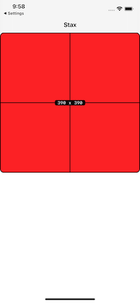
</details>

By setting `animated` to `false` we get rid of the scroll animation and jump straigth to where we want to.

```
// MARK: - Views

lazy var view0 = UIView(square: self.view.frame.width, backgroundColor: .systemOrange, staxDebugOptions: StaxDebugOptions())
lazy var view1 = UIView(width: self.view.frame.width, backgroundColor: .systemBlue, staxDebugOptions: StaxDebugOptions())
lazy var view2 = UIView(width: self.view.frame.width, backgroundColor: .systemRed, staxDebugOptions: StaxDebugOptions())

// MARK: - Layout views

fileprivate func layoutViews() {
    VStack(
        HStack(
            view0,
            view1,
            view2,
            Spacer()
        ).scrolls(.horizontal)
        .scroll(.toRigh, delay: 2, animated: false)
        .height(self.view.frame.width),
        Spacer()
    ).scrolls().layout(in: view)
}
```

<details>
    <summary>Screenshot</summary>
    
</details>

## ⚙️ Stack Options

Stacks are configured for easy layout and it is not advised to change thes options only when you know what you're doing.

```
// MARK: - Views

lazy var view0 = UIView(backgroundColor: .systemOrange, staxDebugOptions: StaxDebugOptions())
lazy var view1 = UIView(backgroundColor: .systemBlue, staxDebugOptions: StaxDebugOptions())
lazy var view2 = UIView(backgroundColor: .systemRed, staxDebugOptions: StaxDebugOptions())

// MARK: - Layout views

fileprivate func layoutViews() {
    VStack(
        HStack(
            view0,
            view1,
            view2,
            Spacer()
        )
        .axis(.horizontal) // optionally set stack axis; default is: .vertical
        .alignment(.fill) // optionally set stack alignment; default is: .fill
        .distribution(.fillEqually) // optionally set stack distribution; default is: .fill
        .height(self.view.frame.width),
        Spacer()
    )
    .scrolls().layout(in: view)
}
```

<details>
    <summary>Screenshot</summary>
    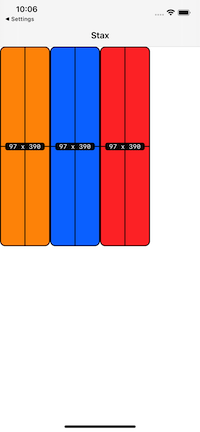
</details>

Note: 
- none of the views have a prespecified size
- the `Spacer()` is counted for the 4th view in the `HStack` and has exactly the same widht as the other views because `distribution` is set to `.fillEqually`

## 🤖 Access the main stack

You might want to access the main stack later on in the lifecycle of the app. Till now we added our main stack in the `viewDidLoad()` but you may also declare it as a `lazy var`. So now you can acces it in the whoe view controller.

```
// MARK: - Views

lazy var view0 = UIView(height: 300, backgroundColor: .systemOrange, staxDebugOptions: StaxDebugOptions())
lazy var view1 = UIView(height: 300, backgroundColor: .systemBlue, staxDebugOptions: StaxDebugOptions())
lazy var view2 = UIView(height: 300, backgroundColor: .systemRed, staxDebugOptions: StaxDebugOptions())

lazy var ui =
    VStack(
        view0,
        view1,
        view2,
        Spacer()
    ).scrolls()

// MARK: - Layout views

fileprivate func layoutViews() {
    ui.layout(in: view).scroll(to: view1, axis: .vertical, offset: 50, delay: 2, animated: true)
}
```

<details>
    <summary>Screenshot</summary>
    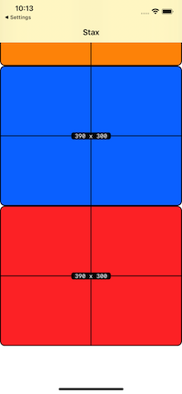
</details>

Note: the `layout(in:)` has to be called in the `layoutViews()` 

## 👁 Show / Hide Views

We may show/hide views with an optional delay and animation. The default `delay` is `0`. Default animation is set to `true`. Can be set to any view that inherits from `UIView`.

```
// MARK: - Views

lazy var view0 = UIView(height: 300, backgroundColor: .systemOrange, staxDebugOptions: StaxDebugOptions())
lazy var view1 = UIView(height: 300, backgroundColor: .systemBlue, staxDebugOptions: StaxDebugOptions())
lazy var view2 = UIView(height: 300, backgroundColor: .systemRed, staxDebugOptions: StaxDebugOptions())

lazy var ui =
    VStack(
        view0,
        view1,
        view2,
        Spacer()
    ).scrolls()

// MARK: - Layout views

fileprivate func layoutViews() {
    ui.layout(in: view)
    
    view1.hide() // instant; you will not notice hiding the view
    view1.show() // instant; you will not notice showing the view
    view1.hide(after: 1)
    view1.show(after: 2, animated: false)
}
```

<details>
    <summary>Screenshot</summary>
    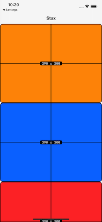
</details>

## 🧪 Change size of a stacked view

You may change a view size after the stack has been set. You may animate this change by adding the root view to the `animatedInRootView` property.

```
// MARK: - Views

lazy var view0 = UIView(height: 300, backgroundColor: .systemOrange, staxDebugOptions: StaxDebugOptions())
lazy var view1 = UIView(height: 300, backgroundColor: .systemBlue, staxDebugOptions: StaxDebugOptions())
lazy var view2 = UIView(height: 300, backgroundColor: .systemRed, staxDebugOptions: StaxDebugOptions())

lazy var ui =
    VStack(
        view0,
        view1,
        view2,
        Spacer()
    ).scrolls()

// MARK: - Layout views

fileprivate func layoutViews() {
    ui.layout(in: view)
    
    DispatchQueue.main.asyncAfter(deadline: DispatchTime.now() + 1) {
        self.view1.height(100/*, animatedInRootView: self.view*/)
    }
    
}
```

<details>
    <summary>Screenshot</summary>
    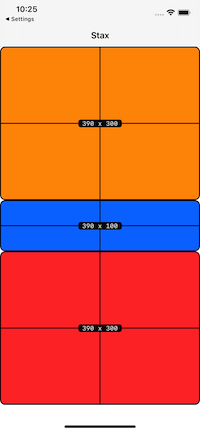
</details>

## 📱 Example

Here is an in depth example view controller detailing all of the features of `Stax`

```
import UIKit
import Stax

class ViewController: UIViewController {
    
    let customStaxDebugOptions = StaxDebugOptions(borderWidth: 5, cornerRadius: 0, color: .systemRed, lineWidth: 10, font: .italicSystemFont(ofSize: 30), textColor: .darkGray, textCornerRadius: 15)
    
    lazy var view1 = UIView(width: self.view.frame.size.width, backgroundColor: .systemYellow, staxDebugOptions: StaxDebugOptions())
    lazy var view2 = UIView(backgroundColor: .systemTeal, staxDebugOptions: customStaxDebugOptions)
    lazy var view3 = UIView(width: self.view.frame.size.width, backgroundColor: .systemRed)
    let view4 = UIView(height: 600, backgroundColor: .systemRed, staxDebugOptions: StaxDebugOptions())
    let view5 = UIView(square: 100, backgroundColor: .systemYellow, staxDebugOptions: StaxDebugOptions())
    let view6 = UIView(square: 100, backgroundColor: .systemOrange, staxDebugOptions: StaxDebugOptions())
    let view7 = UIView(square: 100, backgroundColor: .systemGray, staxDebugOptions: StaxDebugOptions())
    let view8 = UIView(height: 150, backgroundColor: .systemPink, staxDebugOptions: StaxDebugOptions())
    let view9 = UIView(square: 150, backgroundColor: .systemGray2, staxDebugOptions: StaxDebugOptions())
    let view10 = UIView(square: 150, backgroundColor: .systemGray5, staxDebugOptions: StaxDebugOptions())
    let view11 = UIView(height: 50, backgroundColor: .systemGray5, staxDebugOptions: StaxDebugOptionsType.dark)
    let view12 = UIView(height: 50, backgroundColor: .systemGray4, staxDebugOptions: StaxDebugOptionsType.light)
    let view13 = UIView(height: 50, backgroundColor: .systemGray3, staxDebugOptions: StaxDebugOptionsType.adaptive)
    
    lazy var ui =
        VStack(
            HStack(view1,
                   view2.size(width: self.view.frame.size.width, height: 600),
                   view3.debug()).scrolls(.horizontal).padding(.horizontal, 100).pages(),
            HLine(),
            VStack(
                VStack(view4).background(.systemBlue).padding(.vertical, 200),
                HStack(view9, VLine(30, .black, insets: UIEdgeInsets(top: 10, left: 0, bottom: 50, right: 0), withRoundedCorners: false), Spacer(), view10),
                Line(.horizontal, 6, UIColor.black.withAlphaComponent(0.5), insets: UIEdgeInsets(top: 0, left: 48, bottom: 0, right: 48)),
                view8,
                VStack(view11, view12, view13).spacing(),
                Divider(.vertical, 400).background(color: .systemOrange)
            ).spacing(12).padding(.horizontal, 12)
        ).spacing(12)
        //        .axis(.vertical)
        //        .alignment(.fill)
        //        .distribution(.fill)
        .scrolls(.vertical)
        .background(.systemBackground)
        .padding(.bottom, 50)
    
    fileprivate func layoutViews() {
        
        HStack(view5, view6)
            .background(.systemBlue)
            .scrolls(.horizontal)
            .hidesScrollIndicator()
            .scroll(to: view6, axis: .horizontal, delay: 2)
            .scroll(.toLeft, delay: 3)
            .center(inside: view4, size: CGSize(width: 100, height: 100), offset: CGPoint.right(100))

        view7.center(in: view4, offset: CGPoint(x: -80, y: -160))

        ui.layout(in: view, withSafeArea: false)
            .scroll(to: view6, axis: .vertical, offset: 20, delay: 0.5)
            .scroll(.toTop, delay: 5, animated: false)
            .scroll(.toBottom, delay: 7)
            .scroll(.toTop, delay: 11)

        view11.hide(after: 9)
        view11.show(after: 10, animated: false)
        
        DispatchQueue.main.asyncAfter(deadline: DispatchTime.now() + 13) {
            self.view1.height(300, animatedInRootView: self.view)
        }
        DispatchQueue.main.asyncAfter(deadline: DispatchTime.now() + 15) {
            self.view7.height(30, animatedInRootView: self.view)
        }
    }

    override func viewDidLoad() {
        super.viewDidLoad()
        // Do any additional setup after loading the view.
        view.backgroundColor = .systemBackground
        title = "Stax"
        layoutViews()
    }
}

```

## ✍️ Contact

<a href="http://rebeloper.com/">rebeloper.com</a> / 
<a href="http://www.youtube.com/rebeloper/">YouTube</a> / 
<a href="http://store.rebeloper.com/">Shop</a> / 
<a href="http://rebeloper.com/mentoring">Mentoring</a>

## 📃 License

The MIT License (MIT)

Permission is hereby granted, free of charge, to any person obtaining a copy of this software and associated documentation files (the "Software"), to deal in the Software without restriction, including without limitation the rights to use, copy, modify, merge, publish, distribute, sublicense, and/or sell copies of the Software, and to permit persons to whom the Software is furnished to do so, subject to the following conditions:

The above copyright notice and this permission notice shall be included in all copies or substantial portions of the Software.

THE SOFTWARE IS PROVIDED "AS IS", WITHOUT WARRANTY OF ANY KIND, EXPRESS OR IMPLIED, INCLUDING BUT NOT LIMITED TO THE WARRANTIES OF MERCHANTABILITY, FITNESS FOR A PARTICULAR PURPOSE AND NONINFRINGEMENT. IN NO EVENT SHALL THE AUTHORS OR COPYRIGHT HOLDERS BE LIABLE FOR ANY CLAIM, DAMAGES OR OTHER LIABILITY, WHETHER IN AN ACTION OF CONTRACT, TORT OR OTHERWISE, ARISING FROM, OUT OF OR IN CONNECTION WITH THE SOFTWARE OR THE USE OR OTHER DEALINGS IN THE SOFTWARE.
